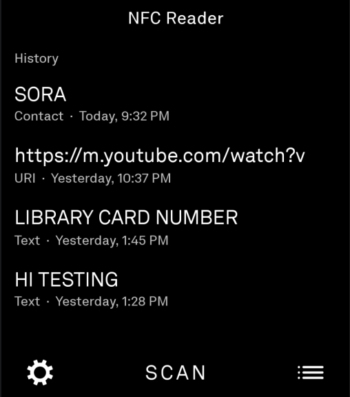
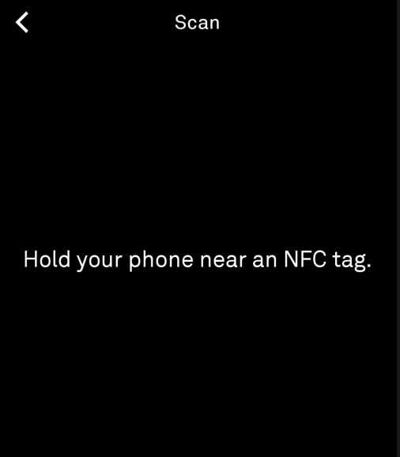
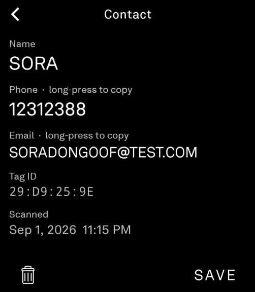
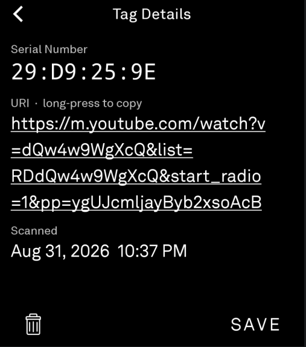
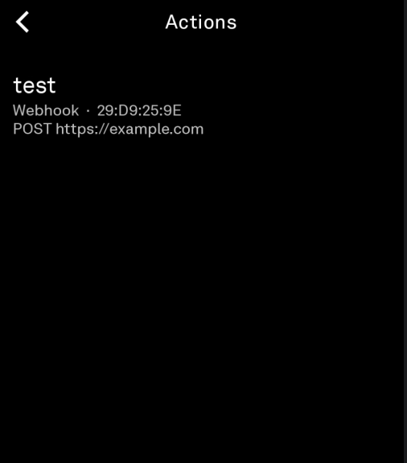
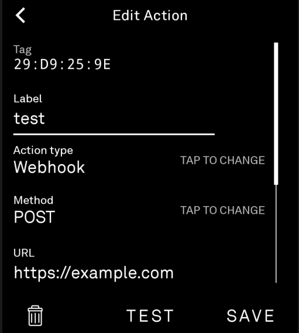

# NFC Reader

Read NFC tags on the [Light Phone III](https://www.thelightphone.com/): tap a tag and the
phone shows and stores what's on it. Bind an **action** to a specific tag and tapping it
can fire a webhook, show a note, or open the dialer.

Built on the [Light SDK](https://github.com/lightphone/light-sdk).

> **Status:** v1.0.0, tested on real LP3 hardware. LightOS does not yet have a way to
> install community tools cleanly, so for now this is sideloaded over ADB. `main` is the
> stable branch; `test` is used for in-progress work.

## Features

- **Scan** NDEF and bare-UID tags
- **Contacts**: vCard tags are parsed into name / phone / email
- **History**: every scan saved locally with a timestamp (Room)
- **Actions** bound to a tag's serial number:
  | Type | What it does |
  |---|---|
  | Webhook | GET/POST/PUT with custom headers, body, optional skip-SSL; has a Test button |
  | Show note | Displays a saved piece of text |
  | Open dialer | Asks LightOS to open the dialer with a number (from the action, or the contact tag), via the SDK's `OpenDialer`. Not every LightOS build honours it yet |
- **Ambient scanning**: while the app is open on any screen, a tap runs the tag's action
  and logs it, with a result banner. NFC is foreground-only, so nothing happens while the
  app is closed or the screen is off.
- **Copy** any value by long-pressing it; **save** a scan to a text file

Full detail: [`nfc-reader/README.md`](nfc-reader/README.md).

## Screenshots

<p align="center">
  
  
  
</p>
<p align="center">
  
  
  
</p>

Scan history and the scan prompt; a contact tag and a URI tag; the actions list and a
webhook action being edited.

## Repo layout

This repository is a checkout of the Light SDK with the tool added as its own module.

| Path | What it is |
|---|---|
| [`nfc-reader/`](nfc-reader/) | **The tool.** All of the NFC Reader source |
| `sdk/`, `plugin/`, `builder/`, `tool/`, `examples/` | Vendored Light SDK, unchanged from upstream |
| [`README.light-sdk.md`](README.light-sdk.md) | The upstream Light SDK README |

Keeping the SDK in-tree is how Light expects community tools to be built and signed
(from a public git commit).

## Build & run

Requires Android Studio (or the command line) with a JDK 17 and the Android SDK.

```sh
# Real Light Phone III over ADB (lighttool.toml already targets com.lightos)
./gradlew :nfc-reader:installDebug

# Just build the APK
./gradlew :nfc-reader:assembleDebug

# Tests
./gradlew :nfc-reader:check
```

For the **LightOS emulator** instead of hardware, set `serverPackage =
"com.thelightphone.sdk.emulator"` in [`nfc-reader/lighttool.toml`](nfc-reader/lighttool.toml).
Emulators have no NFC radio, so the reader shows "This phone can't use NFC". The rest of
the UI still works.

## License

MIT. See [`LICENSE`](LICENSE). The Light SDK is (c) The Light Phone and is included here
under the same license.
