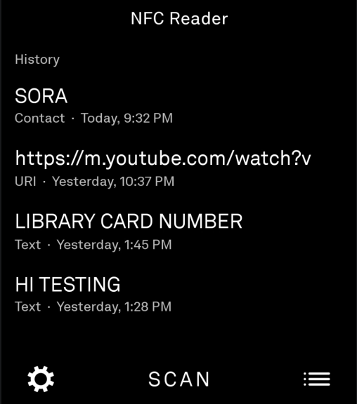
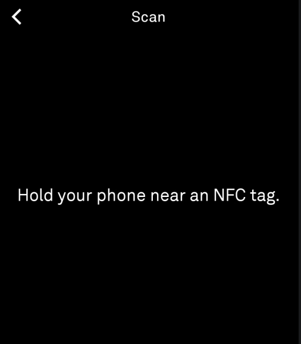
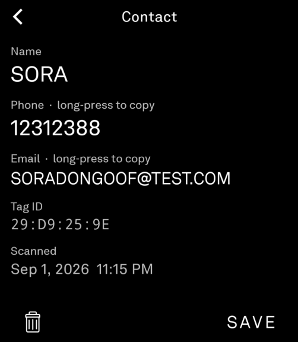
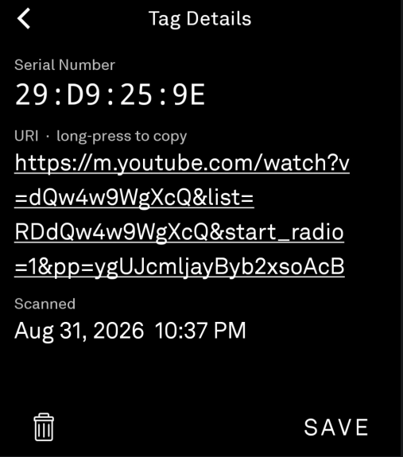
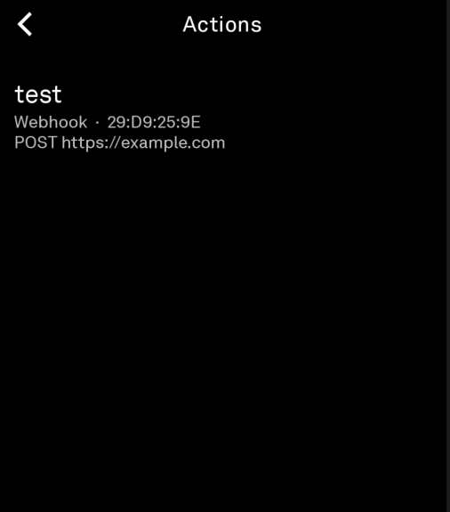
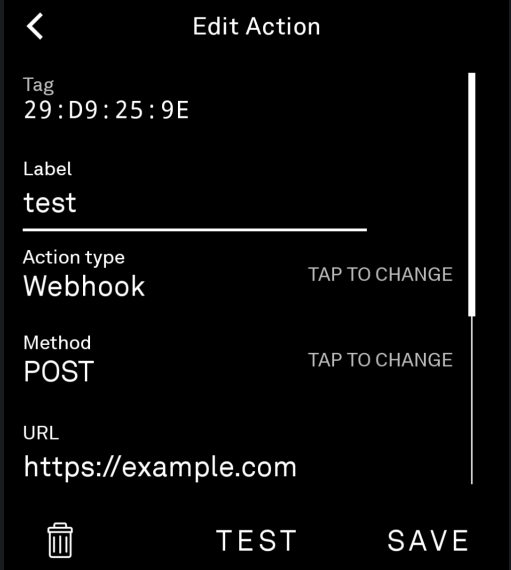

# NFC Reader

An NFC tag reader for the [Light Phone III](https://www.thelightphone.com/). Tap a tag to view and store its contents. Bind an action to a specific tag to fire a webhook, show a note, or open the dialer.

## Features

- **Scan** NDEF and bare-UID tags
- **Contacts**: vCard tags are parsed into name, phone, and email
- **History**: every scan is saved locally with a timestamp (Room)
- **Actions** bound to a tag's serial number:

  | Type | What it does |
  |---|---|
  | Webhook | GET/POST/PUT with custom headers, body, and optional skip-SSL. Includes a Test button |
  | Show note | Displays a saved piece of text |
  | Open dialer | Asks LightOS to open the dialer with a number (from the action or the contact tag) via the SDK's `OpenDialer`. Not every LightOS build supports it yet |

- **Ambient scanning**: while the app is open on any screen, a tap runs the tag's action and logs it with a result banner. NFC is foreground-only, so nothing happens while the app is closed or the screen is off.
- **Copy** any value by long-pressing it; **save** a scan to a text file

Full technical detail: [`nfc-reader/README.md`](nfc-reader/README.md).

## Screenshots

<p align="center">
  
  
  
</p>
<p align="center">
  
  
  
</p>

## Installation

Tested on Light Phone III hardware. LightOS cannot yet install community tools directly, so the app is sideloaded over ADB.

### From Releases

Download the latest APK from [Releases](https://github.com/tyshi00/NFC-Reader/releases) and install it:

```sh
adb install nfc-reader-vX.Y.Z.apk
```

`main` is the stable branch. `test` is for in-progress work.

### From Source

Requires Android Studio (or the command line) with JDK 17 and the Android SDK.

```sh
# Install on a Light Phone III over ADB (lighttool.toml already targets com.lightos)
./gradlew :nfc-reader:installDebug

# Build the APK only
./gradlew :nfc-reader:assembleDebug

# Run tests
./gradlew :nfc-reader:check
```

For the LightOS emulator, set `serverPackage = "com.thelightphone.sdk.emulator"` in [`nfc-reader/lighttool.toml`](nfc-reader/lighttool.toml). Emulators have no NFC radio, so the reader shows "This phone can't use NFC". The rest of the UI still works.

## Credits

Built on the [Light SDK](https://github.com/lightphone/light-sdk) by The Light Phone (MIT). The original copyright notice is kept in [LICENSE](LICENSE), and the SDK's own README is kept in [README.light-sdk.md](README.light-sdk.md).

## License

MIT. See [LICENSE](LICENSE).

## Disclaimer

Unofficial, independent open-source project — not affiliated with or endorsed by The Light Phone, Inc. Light Phone and Light OS are trademarks of The Light Phone, Inc.
